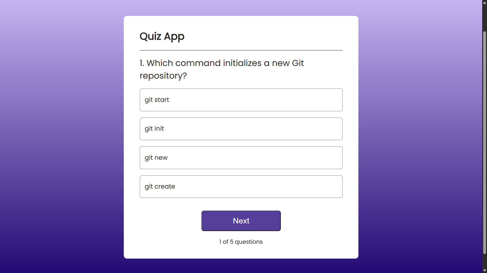
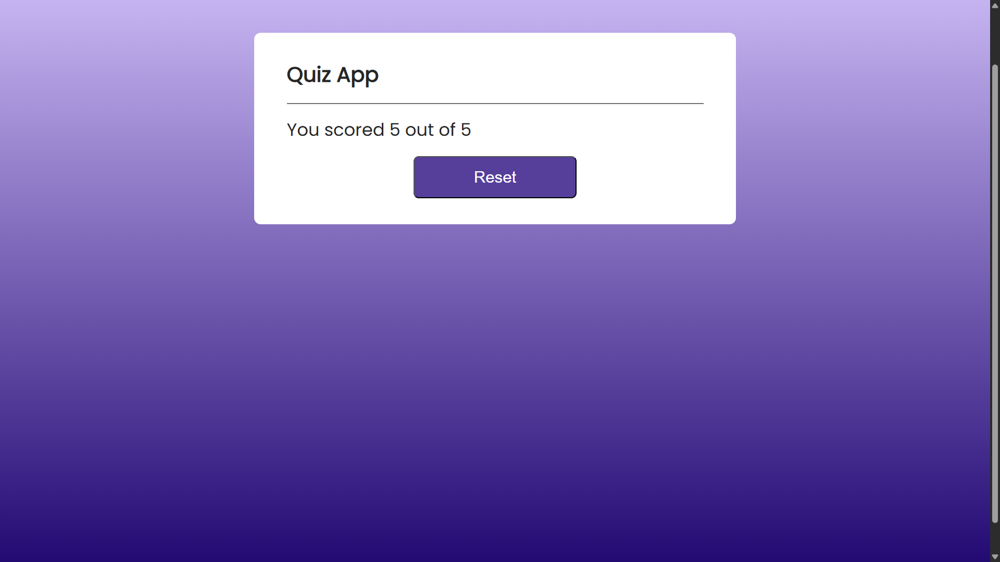

# 📝 <a href="https://yoegeshh.github.io/Quiz-app/">Quiz-app</a> 

A simple and interactive **Quiz Application** built using **React.js, HTML, and CSS**.  
The app presents multiple-choice questions with four options each. It keeps track of the user’s score and shows the correct answer when a wrong option is selected.  

---

## 🚀 Features
- 🎯 Multiple-choice quiz with 4 options per question  
- ✅ Correct answer highlighted when a wrong option is selected  
- 🏆 Score tracking – every correct answer adds to the score  
- 📊 Final score displayed at the end of the quiz  
- ⚡ Built with React Hooks (`useState`, `useRef`)  
- 📱 Fully responsive design  

---

## 🛠️ Tech Stack
- **Frontend:** React.js, HTML5, CSS3  
- **State Management:** React Hooks (`useState`, `useRef`)  

---

## 📸 Snapshots

| Quiz Question | Final Score |
|---------------|-------------|
|  |  |
---

## 📂 Project Structure
quiz-app/
│── src/ # React components & logic
│── public/ # Static files
│── assets/ # data.js file that has bundle of questions as objects.
│── package.json # Dependencies
│── README.md # Documentation


---

## ⚙️ Installation & Setup

1. **Clone the repository**
   ```bash
   git clone https://github.com/your-username/quiz-app.git
   cd quiz-app

2. **Install dependencies**
   ```bash
   npm install

3. **Run the development server**
   ```bash
   npm start

4. Open your browser at http://localhost:🎉

🤝 Contributing

Contributions, issues, and feature requests are welcome!

📜 License

This project is licensed under the MIT License.

🌟 Show Your Support

If you like this project, give it a ⭐ to support the developer! ©yoegeshh
